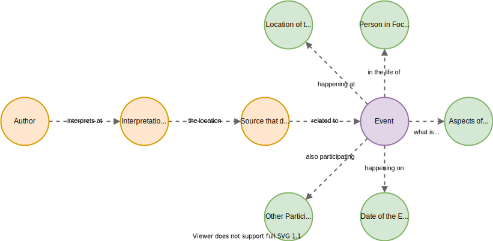
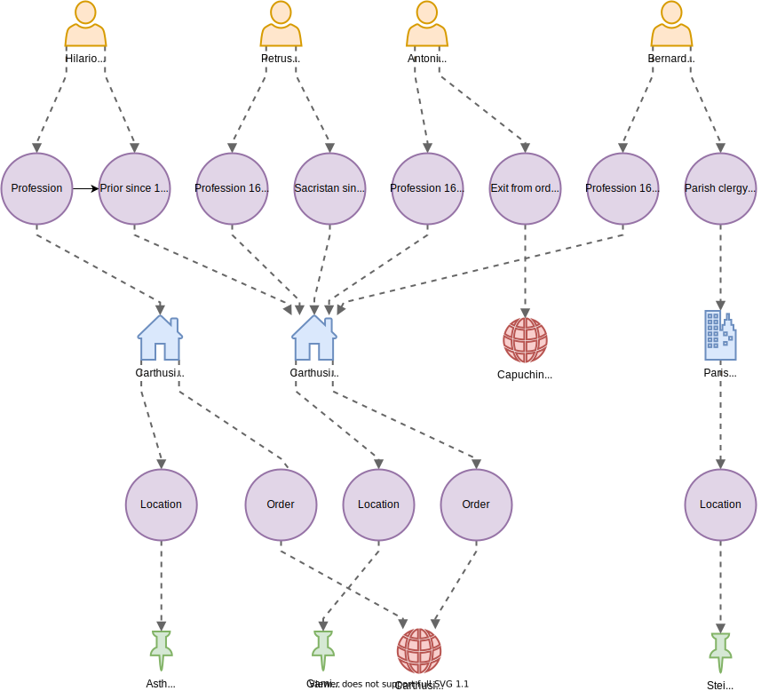

# Data Model

## Core

NAMPI-Core, an ontology that describes the basic interactions specified by the
[Factoid model](https://www.kcl.ac.uk/factoid-prosopography/ontology), more
specifically as the _document interpretation act_ described in the paper on
factoid-based prosopography by Michele Pasin and John Bradley[^1] : Interactions
between authors, sources, locations, and temporal entities, the content of the
interpreted source location. To model this temporal entity in more detail and
enable the system to be better comparable with other data by default, we chose
to limit the shape temporal entities could assume to events as described in
[CIDOC-CRM](http://www.cidoc-crm.org/sites/default/files/Documents/cidoc_crm_version_5.0.4.html#_Toc310250716).

These events can have a time and a place as well as a main person and other
participants, which can be both persons and groups of persons. The interactions
between participants of such events and the wider world are modelled as aspects
that are used in the events. These aspects are not defined in particular detail
to keep the system as expressive as possible; they can range from roles within
groups and occupations of persons to titles and names obtained during an event,
as well as other things. Thus, the main classes in NAMPI-Core are: Act (as in
document-interpretation-act), Author, Source (and Source Location), Event,
Person, Group, Date, Place, and Aspect.

Detail-ontologies are used to provide this model with more details as required
by individual installations of the NAMPI platform and their data/research focus.

### Main entities

The following table shows the main entities used in the core data model.

| Name                                                              | Description                                                                                                                                                                                                                                                                                                                                                                           |
| ----------------------------------------------------------------- | ------------------------------------------------------------------------------------------------------------------------------------------------------------------------------------------------------------------------------------------------------------------------------------------------------------------------------------------------------------------------------------- |
| [Act](http://purl.org/nampi/owl/core#act)                         | A document interpretation act as described by Pasin/Bradley.                                                                                                                                                                                                                                                                                                                          |
| [Actor](http://purl.org/nampi/owl/core#actor)                     | A [person](http://purl.org/nampi/owl/core#person) or [group of persons](http://purl.org/nampi/owl/core#group) that is part of an event. The main participant of an event is always a person.                                                                                                                                                                                          |
| [Aspect](http://purl.org/nampi/owl/core#aspect)                   | The aspects of an event describe what happened at an event in relationship to the main participant. This can be a new name that a person has acquired, a new role in a community / group of people, a new job or any other thing.                                                                                                                                                     |
| [Author](http://purl.org/nampi/owl/core#author)                   | The author of a document interpretation act and person responsible for its content.                                                                                                                                                                                                                                                                                                   |
| [Date](http://purl.org/nampi/owl/core#date)                       | The date of a document interpretation act or event. An event can have multiple dates that either point to an [exact](http://purl.org/nampi/owl/core#takes_place_on) date or a set of [earliest possible](http://purl.org/nampi/owl/core#takes_place_not_earlier_than) / [latest possible](http://purl.org/nampi/owl/core#takes_place_not_later_than) dates the event has happened at. |
| [Place](http://purl.org/nampi/owl/core#place)                     | The place an event has happend at. Like other entities, this can have a [same-as](http://purl.org/nampi/owl/core#same_as) property that identifies the place in other databases like [Geonames](https://www.geonames.org/).                                                                                                                                                           |
| [Source location](http://purl.org/nampi/owl/core#source_location) | A specific location in a source that is used as the reference for the document interpretation act. This can be an online resource, a paragraph or a page in a book                                                                                                                                                                                                                    |
| [Source](http://purl.org/nampi/owl/core#source)                   | The source of the interpretation. This can be a book, an online database or any other source.                                                                                                                                                                                                                                                                                         |

## Monastic Life

NAMPI-Monastic Life is an ontology describing certain aspects of life in and
related to early modern monasteries. This ontology plays the role of a
detail-ontology as described above, inheriting the main classes and properties
from NAMPI-Core and expanding on them. It describes the various religious
orders, communities, and types of roles in terms of status, occupation,
religious titles, and names.

## Ontology files

Both ontologies are already publicly available on Github as well as directly
using a persistent URL:

### Ontologies on GitHub

- [Core source repository](https://github.com/nam-pi/core-owl)
- [Monastic life source repository](https://github.com/nam-pi/monastic-life-owl)

### Ontologies with permalink

- [Persistent core ontology file](https://purl.org/nampi/owl/core)
- [Persistent monastic life ontology file](https://purl.org/nampi/owl/monastic-life)

[^1]:
    Michele Pasin and John Bradley, Factoid-based Prosopography and Computer
    Ontologies: Towards an Integrated Approach, in: Digital Scholarship in the
    Humanities 30 (2015) 86-97.n

