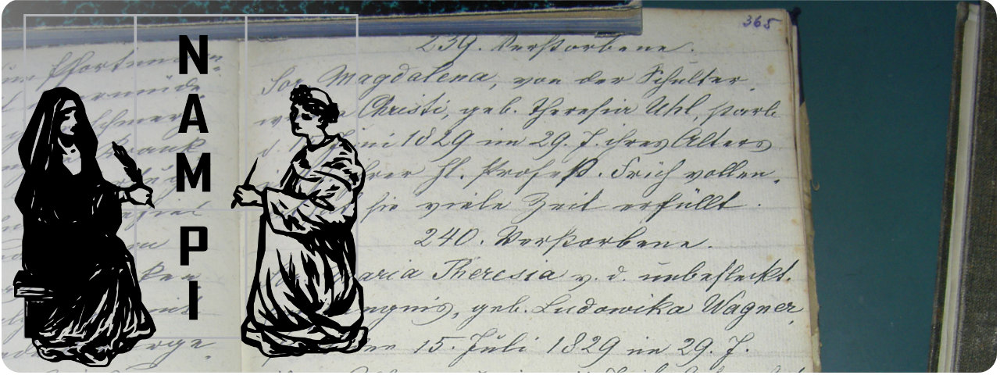

# Welcome to NAMPI

_Nuns and Monks - Prosopograhical Interfaces_ is the product of a project funded
by the Austrian Academy of Sciences. It enables you to [browse](/events) and
[search](/search) through various [aspects](/aspects) in the life of early
modern nuns and monks from Austria and the surrounding areas.

The available data comes from several newly edited sources and new
interpretation of pre-existing databases. To read more about the used sources,
please visit the [data](/info/data) page. To learn more about the underlying
data model, please visit the [data model](/info/model) page.

The website and underlying database was created using a range of open source
tools as well as a re-usable and configurable server for prosopographical data.
To find out more and start using it yourself, please visit the GitHub pages for
the NAMPI [data backend](https://github.com/nam-pi/backend) and
[frontend](https://github.com/nam-pi/frontend).

Contact data is available on the [imprint](/info/imprint) page.

